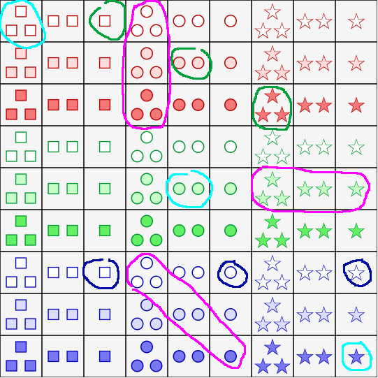

# set

[Play last version online](http://www.codeskulptor.org/#user47_tpZDhJLZSNJthRJ.py)
(click play button, leftmost on blue titleline)

Read [game rules](http://en.wikipedia.org/wiki/Set_%28game%29)

Inspired by Set (c) by Set Enteprises, Inc.

## Rough explanation in one picture what set is:

## details
Implemented in [Codeskulptor](https://en.wikipedia.org/wiki/CodeSkulptor)
Tiles are generated using racket.

It should also be able to run locally if you install [SimpleGUICS2Pygame](https://bitbucket.org/OPiMedia/simpleguics2pygame) or similar package, eg [simpleguitk](https://github.com/dholm/simpleguitk), but I haven't tested that yet in 2020 when I released this.

Created in Nov 2013 as a MVP. It's playable but has some limitations.

## What works:
- mark a set (3 cards), game will remove it if it is really a set and add 3 new cards on the same place
- if it's not a set, it will write message in the console and players have to unmark the cards themselves
- if player thinks there's no sets available, they can request new three cards
- there's also a possibility to remove random three cards to check the functionality

### Implemented:
- Select set
- Removed if correct
- Fill with new cards from deck
- Fill board on demand with new cards
- Have fixed seed, for testing
- Need further refactoring - ranges etc

## What's missing in order to be fully functional game:
- automatically deselecting non-sets
- automatically add new cards if there's no available set on the table
  - accordingly, remove the option for player to ask for more cards (or leave but with score penalty)
- (better) scoring system
- add playing instructions

## Useful additional features that'd be nice to have:
- test: board exhaust
- if there are sets, but I said 'no sets', then penals, else score award
- button for show number of remaining sets - calculate all possible sets on board
- button to show one hint, penals
- init is blank screen, click to start/button
- tutorial with images
- expand the game to work for 2 and 4 type sets, instead of only 3 sets like now

## Licence
Published under [MIT licence](LICENCE)

